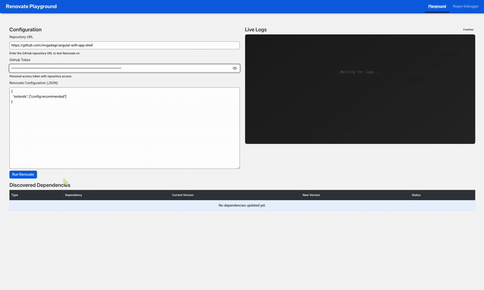

# 🔧 Renovate Playground

<p align="center">
  <strong>A web based playground for testing and debugging <a href="https://github.com/renovatebot/renovate">Renovate</a> configurations in real-time.</strong>
</p>

<p align="center">
  <a href="#-features">Features</a> •
  <a href="#-quick-start">Quick Start</a> •
  <a href="#-usage">Usage</a> •
  <a href="#-development">Development</a> •
  <a href="#-docker">Docker</a> •
  <a href="#-contributing">Contributing</a>
</p>

---

<p align="center">
  
</p>

## ✨ Features

- **🧪 Test Configurations** — Validate Renovate configs before deploying to production
- **🔍 Debug Issues** — Real-time log streaming helps identify configuration problems
- **📊 Visualize Updates** — See package files, proposed updates, and branch information
- **🔒 Safe Experimentation** — Dry-run mode enabled by default, no actual changes made

## 📋 Prerequisites

| Requirement   | Version | Notes                                  |
| ------------- | ------- | -------------------------------------- |
| Node.js       | v22.x+  | Required                               |
| pnpm          | Latest  | Package manager                        |
| Docker/Podman | Any     | Optional, for containerized deployment |

## 🚀 Quick Start

The fastest way to get started is using our pre-built Docker image:

```bash
podman run --platform linux/amd64 -p 8080:8080 ghcr.io/amadeusitgroup/renovate-playground:latest
```

**Open your browser**: Navigate to `http://localhost:8080`

> 💡 **Tip**: Browse all available versions on the [GitHub Container Registry](https://github.com/AmadeusITGroup/renovate-playground/pkgs/container/renovate-playground).

### Building from Source

If you prefer to build locally:

```bash
# Clone the repository
git clone https://github.com/AmadeusITGroup/renovate-playground.git
cd renovate-playground

# Install dependencies
pnpm install

# Start the application
pnpm start
```

Access at `http://localhost:4200` (UI with hot reload) or `http://localhost:8080` (API)

## �� Usage

### Using the Playground

1. **Repository URL** — Enter the full GitHub repository URL  
   _Example: `https://github.com/owner/repo`_

2. **Personal Access Token** — Provide a GitHub PAT with `repo` scope

3. **Renovate Configuration** — Enter your configuration in JSON format

4. **Submit** — Click submit to run Renovate in dry-run mode

5. **View Results** — Monitor real-time logs and analyze the results

### Example Configuration

```json
{
  "extends": ["config:recommended"]
}
```

## 💻 Development

### Available Scripts

| Command          | Description                                         |
| ---------------- | --------------------------------------------------- |
| `pnpm start`     | Start both UI and API (recommended for development) |
| `pnpm start:ui`  | Start Angular UI only (port 4200)                   |
| `pnpm start:api` | Start NestJS API only (port 8080)                   |
| `pnpm build`     | Build all applications                              |
| `pnpm test`      | Run all tests                                       |
| `pnpm lint`      | Lint all projects                                   |
| `pnpm format`    | Format code with Prettier                           |

### Development Modes

#### Unified Mode (Same as Docker)

Run everything on port 8080:

```bash
pnpm start:api
```

Access at `http://localhost:8080`

#### Separate Dev Servers (Hot Reload)

For Angular hot reload during development:

```bash
# Terminal 1 - API server
pnpm start:api

# Terminal 2 - UI dev server with hot reload
pnpm start:ui
```

Access at `http://localhost:4200` (proxies API requests to port 8080)

## 🐳 Docker

### Build and Run

```bash
# Build the image
docker build -t renovate-playground:latest .

# Run the container
docker run -p 8080:8080 renovate-playground:latest
```

Access at `http://localhost:8080`

### Using Podman

```bash
podman build -t renovate-playground:latest .
podman run -p 8080:8080 renovate-playground:latest
```

> 📝 **Note**: The Docker image serves both the API and built UI from the same container on port 8080.

## 🏗️ Architecture

### How It Works

```
┌─────────────┐     ┌─────────────┐     ┌──────────────┐
│   Browser   │────▶│  Angular UI │────▶│  NestJS API  │
│             │◀────│             │◀────│+Renovate CLI │
└─────────────┘     └─────────────┘     └──────────────┘
```

1. **User Input** — Enter repository URL, PAT, and Renovate configuration
2. **Backend Processing** — NestJS spawns Renovate in dry-run mode
3. **Real-time Streaming** — Logs streamed via Server-Sent Events (SSE)
4. **Results Display** — View package files, updates, and branch info

### Project Structure

```
renovate-playground/
├── apps/
│   ├── api/                  # NestJS backend
│   │   └── src/app/
│   │       └── playground/   # Renovate execution service
│   └── ui/                   # Angular frontend
│       └── src/
├── Dockerfile                # Multi-stage production build
├── nx.json                   # Nx workspace configuration
└── package.json              # Dependencies and scripts
```

### Technology Stack

| Layer         | Technology                                   |
| ------------- | -------------------------------------------- |
| **Frontend**  | Angular 20, Amadeus Design Factory           |
| **Backend**   | NestJS 11, Renovate, Node.js child processes |
| **Build**     | Nx monorepo, pnpm                            |
| **Container** | Docker / Podman                              |

## 🤝 Contributing

We welcome contributions! Please see [CONTRIBUTING.md](./CONTRIBUTING.md) for guidelines.

## 📄 License

See [LICENSE](./LICENSE) for details.

---
